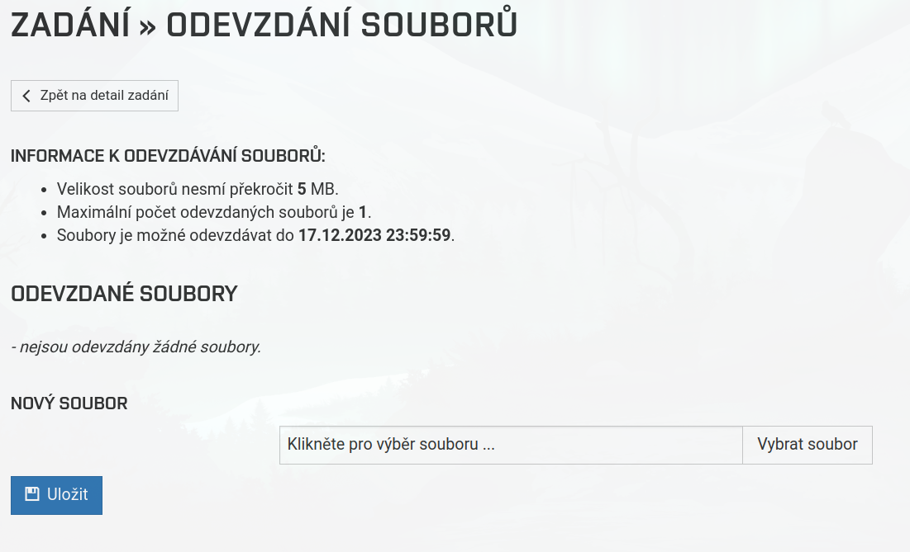

# AutoSubmit

It is a simple script to submit your project to the studis.

## Features

- configurable with config file
- multiple types of authentication
  - prompt for username and password
  - login file with username and password
  - get cookie from browser (optional: needs package `browser-cookie3`)
- automaticly compress archive before submitting
- check file hashes after submitting
- getting time of submission

## What does it do when submitting

1. creates archive if specified
2. gets login information
3. checks if file already submitted
   1. removes old submission
4. submits file
5. checks if file was submitted correctly (`--check` option)
   1. downloads file into `--check_folder`
   2. compares hashes
6. gets time of submission in studis, and prints its value

## Requirements

- python3
- Rest is in `requirements.txt`

## Installation

### Clone repository

Download this repository to the folder where you want to have autosubmit installed.

```bash
git clone https://github.com/nod3zer0/AutoSubmit.git
```

### Install requirements

```bash
pip3 install -r requirements.txt
```

### install in usr/local/bin

```bash
sudo chmod +x submit.py
sudo ln -rs submit.py /usr/local/bin/submit   
```

### update

If you installed it with symbolic link. You can just use `git pull` from where you have downloaded this repository.

## Usage

### From commandline

Prompt for username and password:

```bash
submit --url "<studis_submission_url>" --file <file_to_submit>
```

Use login file:

```bash
submit --url "<studis_submission_url>" --file <file_to_submit> --login_file <login_file>
```

Use cookie from browser:

```bash
submit --url "<studis_submission_url>" --file <file_to_submit> --cookie <cookie_name>
```

### with config file

Running in same folder as config file:

```bash
submit
```

Running with config file in different folder:

```bash
submit --config <path_to_config_file>
```

### Workflow

1. create config file in your project folder
   1. set `file` to file you want to submit
   2. optionally set `archive_command` to command for creating archive
   3. set `url` to submission url 
   4. optionally set `check` to true
      1. set `check_folder` to folder where to download file for checking
   5. set `login_type` to login type
      1. set `login_file` to path to login file
2. run `autosubmit.py` in your project folder. The file will be submitted and checked if `check` is set to true.

## Config file

The config file is a simple yaml file.

Example config file:

```yaml
# filepath to file to submit
file: xlogin.tar
# command for creating archive (leave blank if you dont want to create archive)
archive_command: tar -cvf xlogin.tar file1.c file2.c
# url of where to upload file
url: https://www.vut.cz/studis/student.phtml?sn=zadani_odevzdani&registrace_zadani_id=971964&apid=268279
#compares hasesh of uploaded and local file after upload
check: true
#where to download file after uploading for hash checking
#(folders will be created, files will be owerwritten!)
check_folder: test_folder
# for login with browser cookies fill in browser
browser: brave
# fill in path to yaml file with login information
login_file: /home/username/login.yml
#broser_cokies/login_file/prompt
login_type: login_file
```

## config values

Same values can be used as command line arguments, and they will override values in config file.

- `file` - path to file to submit (short command line argument: `-f`)
- `archive_command` - command for creating archive (leave blank if you dont want to create archive) (short command line argument: `-a`)
- `url` - url of where to upload file (short command line argument: `-u`) 
- `check` - compares hashes of uploaded and local file after upload (short command line argument: `-c`)
- `check_folder` - where to download file after uploading for hash checking (folders will be created, files will be owerwritten!)
- `browser` - for login with browser cookies fill in browser. Needs to be used with `login_type browser_cookies` (optional: needs package `browser-cookie3`)
- `login_file` - fill in path to yaml file with login information
- `login_type` - browser_cookies/login_file/prompt (short command line argument: `-l`)
  - browser_cookies - get cookie from browser (optional: needs package `browser-cookie3`)
  - login_file - use login file (path specified in `login_file`)
    - if you specify only username, it will prompt for password
  - prompt - prompt for username and password

## Example login file

```yaml
username: xlogin00
password: password
```

If there is only username, it will ask for password in terminal.

```yaml
username: xlogin00
```

## Theory

### How does login work

Each time login page is refreshed, it gets new sv[fdkey] from server. So this script first gets this value from login page, and then sends it back with username, password and timestamp, to get session cookie.

### How does file submission work

First it gets the page with submission form, and gets the s_key and s_tkey (which is new every time page gets refreshed). Then it sends the file these values and the session.

## TODO

- [ ] moodle (ELEARNING) support
- [ ] support multiple files
- [ ] git hook after merge/commit to master
- [ ] save cookies for later use for faster submissions
